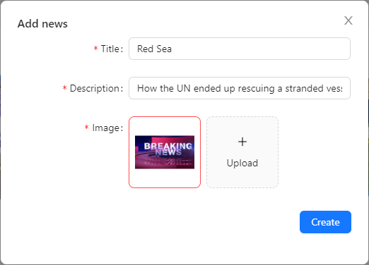

# React Test Task

## Usage

### Install dependencies

```
yarn install
```

### Run React dev server (http://localhost:3000) and the JSON server (http://localhost:5000)

```
npm run dev 
```

### Run React dev server (http://localhost:3000)

```
npm run start
```

### To build for production

```
npm run build
```

## Output





 


